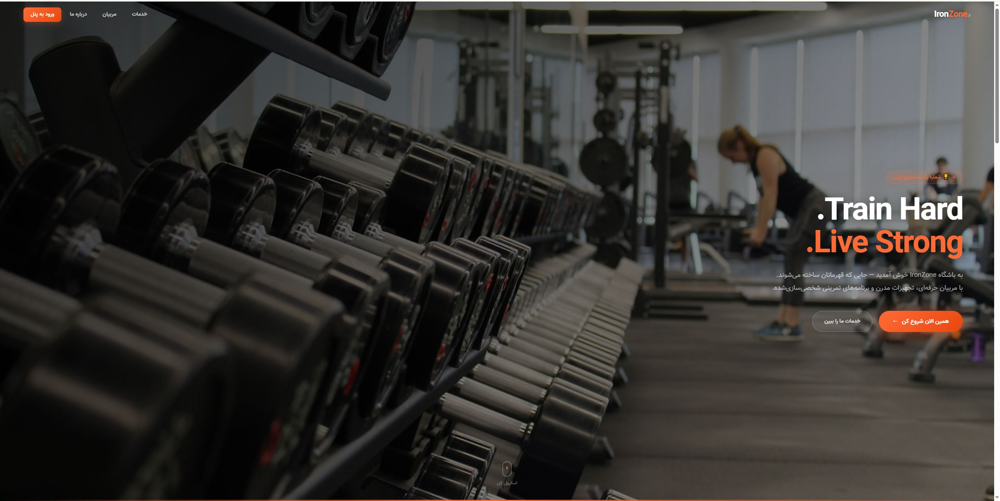
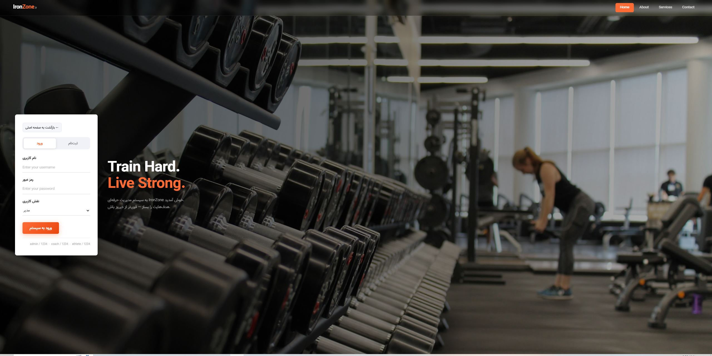
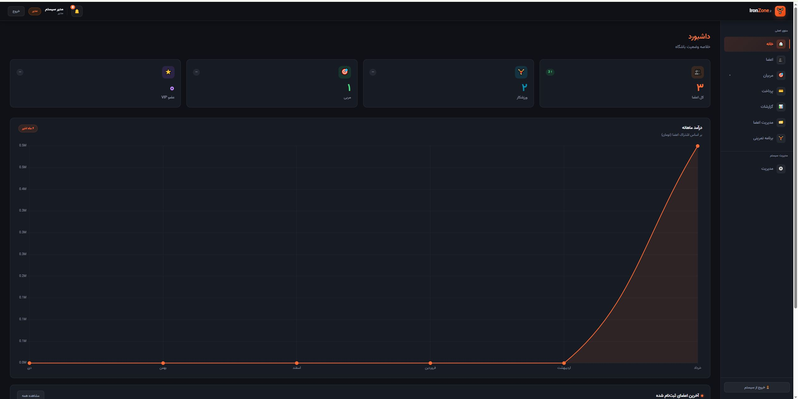
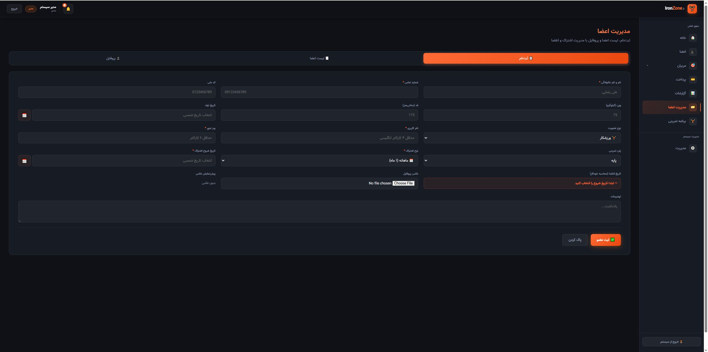
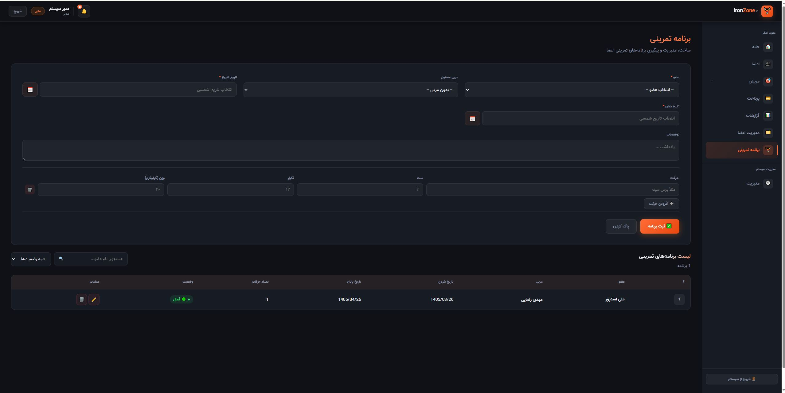

# 🏋️ IronZone - سیستم مدیریت باشگاه بدنسازی

سیستم جامع مدیریت باشگاه بدنسازی با رابط کاربری
فارسی و تم تاریک حرفه‌ای

---

## ✨ قابلیت‌ها

### 👥 مدیریت کاربران
- سیستم ورود با ۳ نقش (مدیر / مربی / ورزشکار)
- سطح دسترسی اختصاصی برای هر نقش
- مدیریت اعتبارنامه‌ها توسط admin
## 📸 اسکرین‌شات‌ها

### Landing Page

### صفحه ورود

### داشبورد

### مدیریت اعضا

### برنامه تمرینی

### 👤 مدیریت اعضا
- ثبت، ویرایش و حذف اعضا
- پروفایل کامل با عکس
- تقویم شمسی برای تاریخ‌ها
- وضعیت رنگی (فعال/نزدیک انقضا/منقضی)

### 🎯 مدیریت مربیان
- ۳ رشته تخصصی: بدنسازی / کراسفیت / یوگا
- نمایش برترین مربی هر رشته در Landing Page
- فیلتر مربیان بر اساس رشته

### 🏋️ برنامه تمرینی
- ساخت برنامه تمرینی برای هر ورزشکار
- تخصیص مربی به برنامه
- لیست حرکات با ست/تکرار/وزن
- ویرایش و حذف برنامه

### 💳 پرداخت و مالی
- ثبت پرداخت‌ها
- تاریخچه پرداخت هر عضو
- تمدید اشتراک

### 📊 گزارشات
- نمودار درآمد ماهانه و سالانه
- توزیع نوع عضویت و پلن‌ها

### 🔔 یادآوری انقضا
- بنر هشدار برای ورزشکار (۷ روز قبل از انقضا)
- لیست اعضای در شرف انقضا در داشبورد admin

---

## 🛠 تکنولوژی‌ها

- HTML5 / CSS3 / JavaScript (Vanilla)
- Chart.js (نمودارها)
- jalaali-js (تقویم شمسی)
- فونت Vazirmatn
- localStorage (ذخیره‌سازی)

---

## 🚀 نحوه اجرا

فقط فایل index.html را در مرورگر باز کنید:

کاربران پیش‌فرض:
- مدیر: admin / 1234
- مربی: coach / 1234
- ورزشکار: athlete / 1234

---

## 🎨 طراحی

- تم: تاریک (Dark Mode)
- رنگ اصلی: نارنجی #FF6B35
- جهت: راست‌چین (RTL) فارسی
- ریسپانسیو: بله

---

## 👤 توسعه‌دهنده

- نام: Ali Asadpour
- گیت‌هاب: https://github.com/alidev1991
